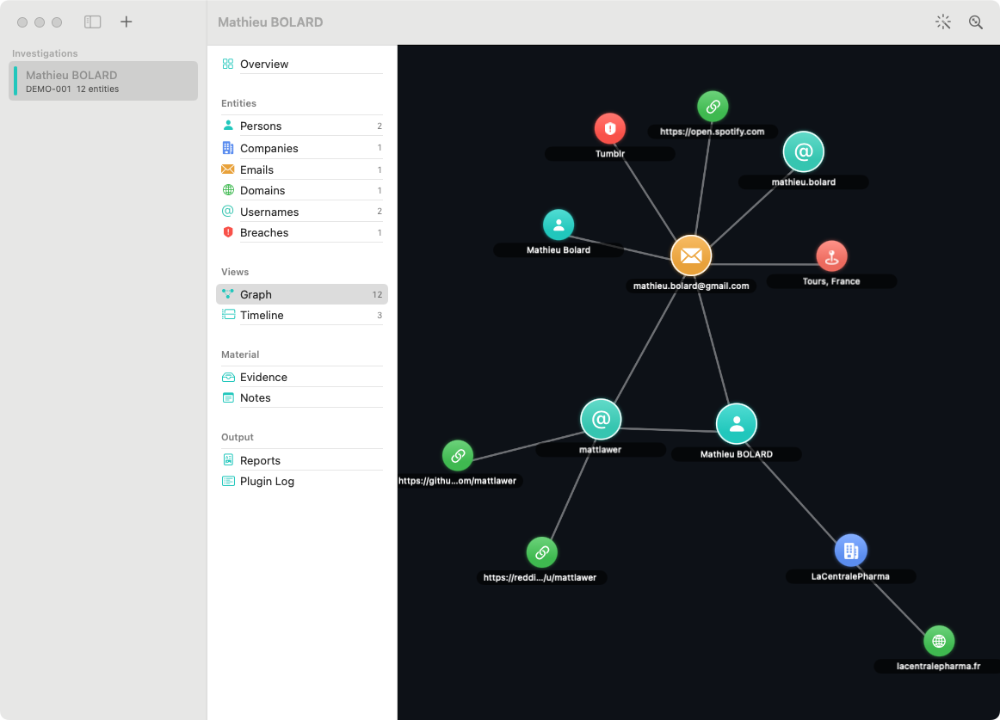
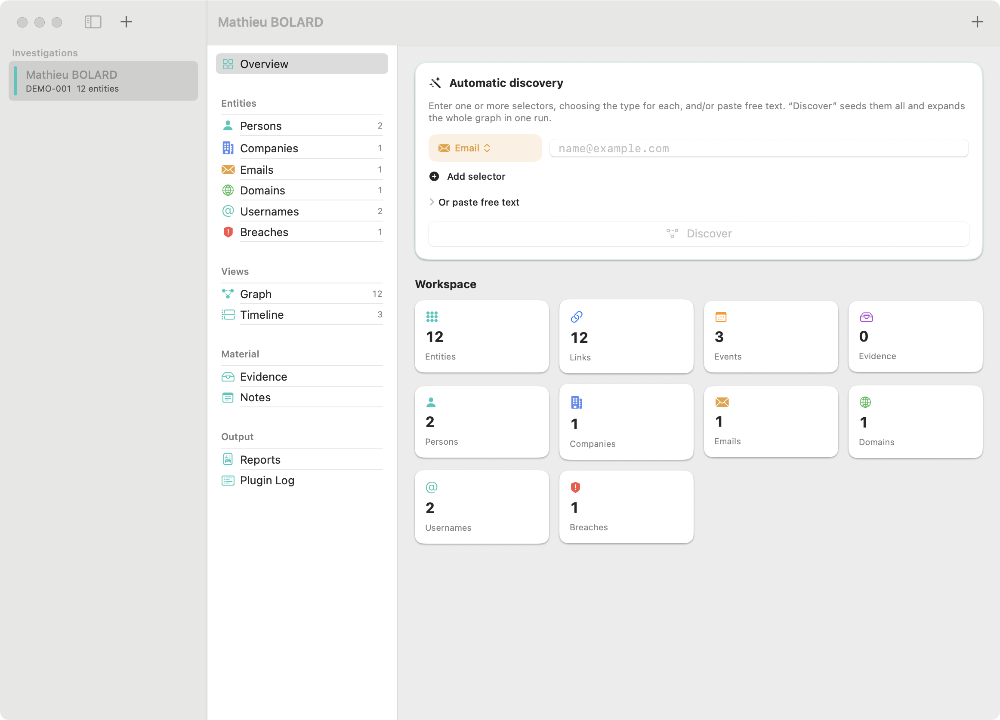
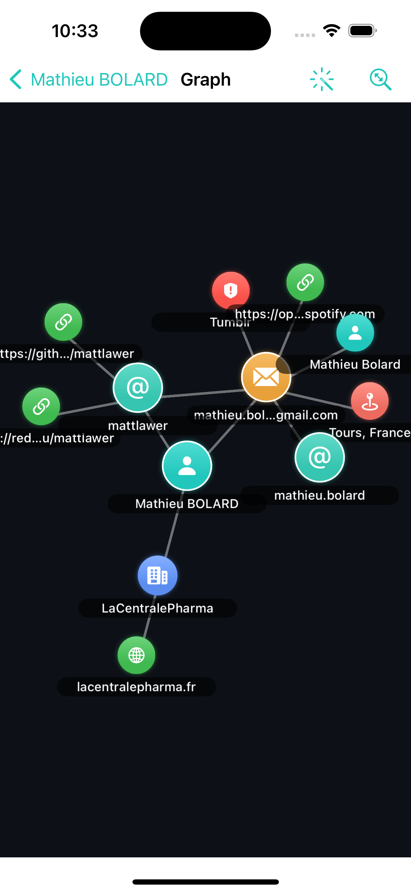

<div align="center">

# Noeron

**The intelligence workspace for digital investigations.**

A native macOS · iPadOS · iOS OSINT platform. Paste a selector — an email, domain, IP, username, phone or company — and Noeron fans out a **graph automatically**: it runs its plugins, links every finding, timelines the dated facts, and lets you export a court‑ready report.

Most of it works with **zero configuration and no API keys**.

[](#requirements)
[](https://swift.org)
[](https://developer.apple.com/xcode/swiftui/)
[](LICENSE)

[Quick start](#quick-start) · [How it works](#how-it-works) · [Plugins](#plugins) · [Write a plugin](docs/PLUGIN-DEVELOPMENT.md) · [Docs](#documentation) · [Contributing](CONTRIBUTING.md)

</div>

---

## What it does

You paste a selector and Noeron does the rest:

```
mathieu@example.com
   ├─ Email Intelligence ─→ example.com (domain) + "mathieu" (username candidate)
   │       ├─ WHOIS / DNS / SSL-CT ─→ registrant org, IPs, certs, subdomains
   │       ├─ Subdomain Enum ──────→ mail.example.com, vpn.example.com …
   │       └─ GitHub / Reddit / … ─→ profiles for the username
   ├─ Gravatar ───────────→ real name, avatar, linked accounts
   ├─ GitHub (commit email) → the GitHub identity behind the address
   ├─ XposedOrNot ─────────→ breaches the email appears in   (free, no key)
   └─ Account Existence ───→ Firefox / Duolingo / Spotify registration
```

Everything is a node on a **graph**, every dated fact lands on a **timeline**, and the whole investigation exports to **Markdown / HTML / PDF** with provenance.

<div align="center">



<sub><b>macOS — paste a selector and the graph builds itself</b></sub>

<br/><br/>

<table>
<tr>
<td></td>
<td></td>
</tr>
<tr>
<td align="center"><b>Type a selector → Discover (macOS)</b></td>
<td align="center"><b>…the same app on iOS</b></td>
</tr>
</table>

<sub>One native SwiftUI app for <b>macOS · iPadOS · iOS</b>. Demo investigation seeded offline from <code>mathieu.bolard@gmail.com</code>, <i>Mathieu BOLARD</i>, <code>@mattlawer</code>. Regenerate with <a href="scripts/screenshots-macos.sh"><code>scripts/screenshots-macos.sh</code></a> / <a href="scripts/screenshots.sh"><code>scripts/screenshots.sh</code></a>.</sub>
</div>

## Highlights

- **Keyless‑first.** ~30 of 42 plugins need no account, no key, no setup. Enter an email and get a lot back immediately.
- **Automatic discovery.** Breadth‑first expansion turns one selector into a full picture; every new node is itself expanded up to a depth/entity cap you control.
- **Free alternatives to paid services.** XposedOrNot for HaveIBeenPwned, Shodan InternetDB for Shodan, the French gov registry for OpenCorporates — on by default, with the paid service one key away.
- **Noise‑aware.** Provider/CDN/mail infrastructure (Google, Cloudflare, consumer ISPs…) is filtered so an `@gmail.com` address doesn't drag in all of Google.
- **A real plugin system.** One `Plugin` protocol; a plugin is a pure, `Sendable` transform from an entity snapshot to structured findings. [Write one in ~40 lines.](docs/PLUGIN-DEVELOPMENT.md)
- **Native & private.** SwiftUI + SwiftData, optional iCloud sync, Keychain‑stored keys, evidence hashed for chain of custody. No backend, no telemetry.

## How it works

1. **Extract** — `EntityExtractor` recognises selectors in free text (or you type them with explicit types).
2. **Run** — the `DiscoveryEngine` runs every enabled, applicable plugin on the seed, **concurrently and off the main actor**.
3. **Merge** — findings are written into the SwiftData graph with node/edge/event de‑duplication and provenance.
4. **Expand** — each newly discovered node is queued and expanded breadth‑first, up to the configured depth and entity cap.

See [docs/DISCOVERY-ENGINE.md](docs/DISCOVERY-ENGINE.md) for the full algorithm and threading model.

## Plugins

A plugin is a small type conforming to `Plugin`: it declares metadata (which entity kinds it accepts/produces, whether it needs a key) and implements `run(on:context:)`. The engine handles everything else.

| Group | Examples | Auth |
|---|---|---|
| **Keyless, on by default** | WHOIS · DNS · SSL/CT · IP Geolocation · ASN · Subdomain Enumeration · Wayback · Typosquat · Reverse IP/PTR · urlscan.io · Geocoding · Email Intelligence · Gravatar · GitHub (+by‑email) · Account Existence · EmailRep · Phone Intelligence · Username Sweep · Company Registry · XposedOrNot · Shodan InternetDB · Bitcoin On-chain · Ethereum On-chain · Solana On-chain · Wikidata · SEC EDGAR · Reddit · Mastodon · Bluesky | None |
| **Key‑based (optional, often deeper)** | Shodan · Censys · Hunter · HaveIBeenPwned · Intelligence X · VirusTotal · OpenCorporates · Companies House · LinkedIn · Telegram · Historical DNS · Google Dorks (SerpAPI / Google CSE) | Your key, stored in the Keychain |

A full map of every well‑known OSINT tool and the Noeron plugin that covers it is in **[docs/OSINT-TOOLS.md](docs/OSINT-TOOLS.md)**.

## Download (macOS)

Grab the latest **`Noeron-macOS.zip`** from the [Releases](../../releases) page, unzip it, and move `Noeron.app` to `/Applications`.

The release build is ad‑hoc signed (not notarized), so on first launch macOS will warn it's from an unidentified developer. Either **right‑click the app → Open** once, or clear the download quarantine:

```bash
xattr -dr com.apple.quarantine /Applications/Noeron.app
```

iOS/iPadOS aren't distributable this way — build and run those from Xcode (below). For a warning‑free macOS download, see [notarization](docs/BUILDING.md#releases).

## Quick start

**Requirements:** Xcode 16+ (macOS 14 / iOS 17 SDKs), and [XcodeGen](https://github.com/yonaskolb/XcodeGen).

```bash
brew install xcodegen
cd Noeron
xcodegen generate          # creates Noeron.xcodeproj from project.yml
open Noeron.xcodeproj
```

In Xcode: set your Team under **Signing & Capabilities**, pick the **Noeron** scheme, and run on a Mac, iPad or iPhone.

```bash
# Headless build check (no signing):
xcodebuild -project Noeron.xcodeproj -scheme Noeron_macOS \
  -destination 'generic/platform=macOS' CODE_SIGNING_ALLOWED=NO build
```

See [docs/BUILDING.md](docs/BUILDING.md) for signing, iCloud, and troubleshooting.

## Project layout

```
Noeron/
├── project.yml                 XcodeGen spec (universal app target)
├── docs/                       all documentation (start at docs/README.md)
└── Noeron/
    ├── NoeronApp.swift          @main · ModelContainer · Settings scene · deep links
    ├── Models/                  SwiftData @Model layer (Entity, EntityLink, Investigation, …)
    ├── Plugins/                 Plugin protocol & registry; one file per plugin under
    │                            Live/ · Public/ · KeyBased/ (+ Shared/ helpers)
    ├── Intelligence/            selector extraction + label normalisation
    ├── Graph/                   DiscoveryEngine (BFS expansion) + force-directed layout
    ├── Reports/                 Markdown · HTML · PDF export
    ├── Spotlight/ · Intents/ · QuickLook/   OS integrations
    ├── Support/                 AppState, Keychain, Evidence store, Theme
    └── Views/                   SwiftUI: sidebar · workspace · graph · timeline · inspector
```

## Documentation

| Doc | What it covers |
|---|---|
| [docs/ARCHITECTURE.md](docs/ARCHITECTURE.md) | Subsystems, layering, and data flow end to end |
| [docs/DATA-MODEL.md](docs/DATA-MODEL.md) | Entities, links, attributes, the SwiftData/CloudKit schema |
| [docs/DISCOVERY-ENGINE.md](docs/DISCOVERY-ENGINE.md) | The BFS expansion algorithm, threading, de‑duplication |
| [docs/PLUGIN-DEVELOPMENT.md](docs/PLUGIN-DEVELOPMENT.md) | **Write a plugin** — protocol, examples, testing, checklist |
| [docs/OSINT-TOOLS.md](docs/OSINT-TOOLS.md) | Tool‑by‑tool coverage map (keyless vs. key) |
| [docs/BUILDING.md](docs/BUILDING.md) | Build, sign, iCloud, troubleshooting |
| [docs/OPEN-SOURCE-PLAN.md](docs/OPEN-SOURCE-PLAN.md) | The plan to open‑source Noeron and grow a plugin ecosystem |
| [CONTRIBUTING.md](CONTRIBUTING.md) · [SECURITY.md](SECURITY.md) · [CODE_OF_CONDUCT.md](CODE_OF_CONDUCT.md) | How to contribute, report issues, and behave |

## Write a plugin

```swift
struct MyPlugin: Plugin {
    var metadata: PluginMetadata {
        .init(id: "my-source", name: "My Source",
              summary: "What it returns.",
              category: .network, acceptedKinds: [.domain],
              producesKinds: [.ipAddress], isLive: true)
    }

    func run(on entity: EntitySnapshot, context: PluginContext) async throws -> PluginResult {
        let data = try await context.getJSON(MyResponse.self, from: endpoint(for: entity.label))
        var result = PluginResult()
        result.entities.append(.init(kind: .ipAddress, label: data.ip,
                                     linkKind: .resolvesTo, linkDirection: .fromInput))
        return result
    }
}
```

Register it in `PluginRegistry.defaultCatalogue` and it shows up in Settings and auto‑discovery. Full guide: **[docs/PLUGIN-DEVELOPMENT.md](docs/PLUGIN-DEVELOPMENT.md)**.

## Roadmap

- A public **plugin registry / template repo** so plugins can ship outside the app bundle.
- ExifTool‑style local image metadata (GPS/camera) on `.image` evidence.
- Manual **entity merge** in the inspector for cross‑source identity resolution.
- Saved discovery "recipes", per‑plugin rate limiting, graph clustering.

See [docs/OPEN-SOURCE-PLAN.md](docs/OPEN-SOURCE-PLAN.md) for the bigger picture.

## Responsible use

Noeron is for **lawful, authorised investigations using open sources** — due diligence, threat intelligence, journalism, security research, incident response. You are responsible for complying with the terms of every data source, applicable data‑protection law (e.g. GDPR/CCPA), and the privacy and safety of the people involved. Noeron ships with no offensive capability: plugins only read public data through documented endpoints.

## License

[MIT](LICENSE). Contributions are accepted under the same license — see [CONTRIBUTING.md](CONTRIBUTING.md).
